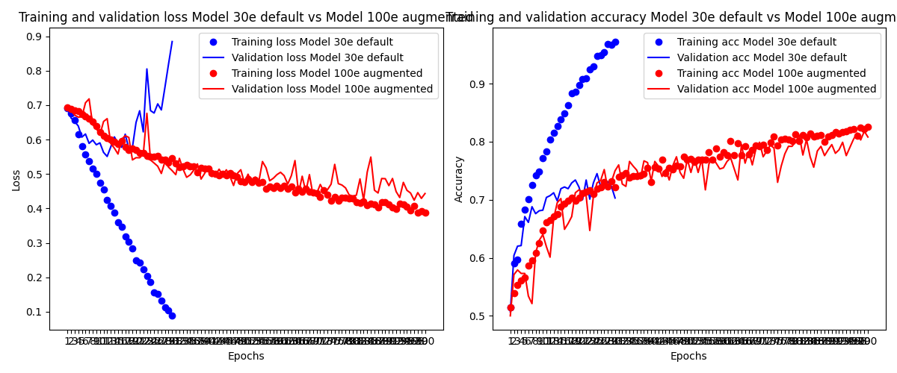
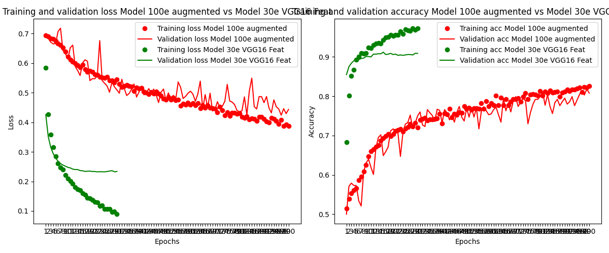
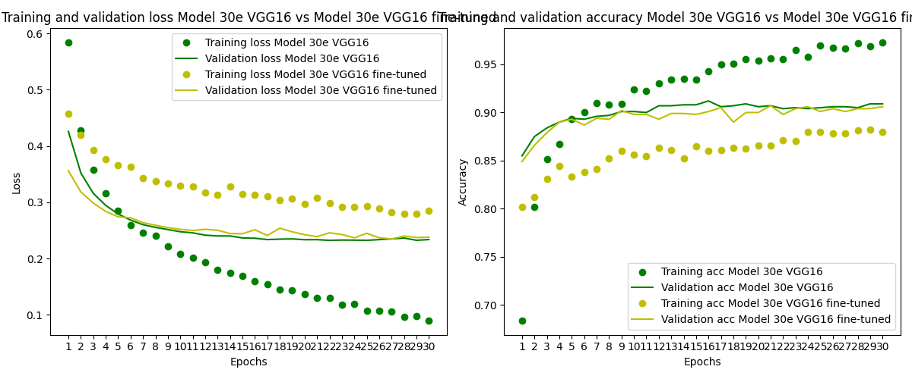
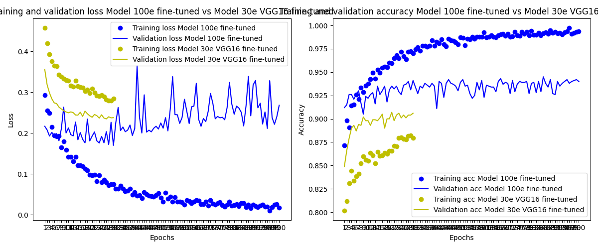

# Cães vs Gatos

[English Version](./README.md)

Exercício do curso de Ciência de Dados e Inteligência Artificial da PUC-SP para classificar imagens de cães e gatos e aprender conceitos de Deep Learning com Python, TensorFlow e Keras.

## Conceitos aprendidos

- Uso de aumento de dados (data augmentation) para aumentar o tamanho do conjunto de treinamento e reduzir o overfitting
- Uso de um modelo pré-treinado (VGG16) para classificar imagens com três estratégias diferentes:
    - Extração de características da base convolucional e treinamento de um classificador em cima dessas características (mais rápido e barato)
    - Adição de um classificador em cima da base convolucional e ajuste fino das camadas superiores da base convolucional junto com o classificador (mais caro e demorado, mas pode levar a melhores resultados)
    - Ajuste fino das camadas superiores da base convolucional junto com o classificador (mais caro e demorado, mas pode levar a melhores resultados)

## Descrição dos modelos

#### 30 Épocas Conv

Uma rede neural convolucional simples treinada por 30 épocas.

#### 100 Épocas Conv Data Aug

Uma rede neural convolucional com aumento de dados treinada por 100 épocas.

#### VGG16 Features + 30 Épocas Dense

Um modelo VGG16 pré-treinado é usado para extrair características e alimentá-las a um classificador treinado por 30 épocas (os dados passam pela base convolucional apenas uma vez, sendo mais rápido e barato do que ajustar fino as camadas superiores da base convolucional junto com o classificador).

#### VGG16 Conv Base + 30 Épocas Dense

Um modelo VGG16 pré-treinado com todas as camadas congeladas e com um classificador denso adicionado em cima dele, treinado por 30 épocas (os dados passam pela base convolucional a cada vez, sendo mais caro e demorado do que extrair características da base convolucional e treinar um classificador em cima delas, mas pode levar a melhores resultados).

#### VGG16 Conv Base + Última Camada Ajustada 100 Épocas

Um modelo VGG16 pré-treinado com as camadas superiores da base convolucional descongeladas e um classificador treinado em cima dele por 100 épocas (mais caro e demorado do que adicionar um classificador em cima da base convolucional e treinar as camadas superiores da base convolucional junto com o classificador, mas pode levar a melhores resultados).

## Comparação de perda e acurácia no treinamento dos modelos

### 30 Épocas Conv vs 100 Épocas Conv Data Aug

| Modelo | Acurácia na Validação | Acurácia no Teste | Tempo de Treinamento | Arquivo do Modelo |
| --- | --- | --- | --- | --- |
| 30 Épocas Conv | 0.7030 | 0.7289 | 4 minutos | cats_and_dogs_small_1.keras |
| 100 Épocas Conv Data Aug | 0.8080 | 0.8009 | 17 minutos | cats_and_dogs_small_2.keras |

Com este gráfico podemos ver que o modelo com aumento de dados tem um desempenho melhor do que o modelo sem aumento de dados e aumentar o número de épocas para 100 melhora a acurácia do modelo (ou seja, o modelo ainda tem espaço para melhorar em 30 épocas).

### 100 Épocas Conv Data Aug vs VGG16 Features + 30 Épocas Dense

| Modelo | Acurácia na Validação | Acurácia no Teste | Tempo de Treinamento | Arquivo do Modelo |
| --- | --- | --- | --- | --- |
| 100 Épocas Conv Data Aug | 0.8080 | 0.8009 | 17 minutos | cats_and_dogs_small_2.keras |
| VGG16 Features + 30 Épocas Dense | 0.9090 | 0.8889 | 16 segundos | cats_and_dogs_small_3.keras |

Ao comparar esses dois modelos, podemos ver que o modelo usando características do VGG16 tem um desempenho melhor, mesmo tendo sido treinado por menos épocas. Isso mostra o poder de usar um modelo pré-treinado para acelerar o processo de treinamento e melhorar a acurácia do modelo.

### VGG16 Features + 30 Épocas Dense vs VGG16 Conv Base + 30 Épocas Dense

| Modelo | Acurácia na Validação | Acurácia no Teste | Tempo de Treinamento | Arquivo do Modelo |
| --- | --- | --- | --- | --- |
| VGG16 Features + 30 Épocas Dense | 0.9090 | 0.8889 | 16 segundos | cats_and_dogs_small_3.keras |
| VGG16 Conv Base + 30 Épocas Dense | 0.9060 | 0.8939 | 25 minutos | cats_and_dogs_small_4.keras |

Ao comparar a estratégia de extração de características com a estratégia de ajuste fino das camadas superiores, podemos ver que a estratégia de ajuste fino tem um desempenho ligeiramente melhor. No entanto, a estratégia de ajuste fino é muito mais cara e demorada do que a estratégia de extração de características.

### VGG16 Conv Base + 30 Épocas Dense vs VGG16 Conv Base + Última Camada Ajustada 100 Épocas

| Modelo | Acurácia na Validação | Acurácia no Teste | Tempo de Treinamento | Arquivo do Modelo |
| --- | --- | --- | --- | --- |
| VGG16 Conv Base + 30 Épocas Dense | 0.9060 | 0.8939 | 25 minutos | cats_and_dogs_small_4.keras |
| VGG16 Conv Base + Última Camada Ajustada 100 Épocas | 0.9400 | 0.9409 | 95 minutos | cats_and_dogs_small_4ft.keras |

Ao comparar a estratégia de ajuste fino das camadas superiores com a estratégia de ajuste fino da última camada, podemos ver que a estratégia de ajuste fino da última camada é a que apresenta o melhor desempenho entre todos os modelos treinados. No entanto, a estratégia de ajuste fino da última camada é muito mais cara e demorada do que a estratégia de ajuste fino das camadas superiores.

## Resumo dos resultados dos modelos

| Modelo | Acurácia na Validação | Acurácia no Teste | Tempo de Treinamento | Arquivo do Modelo |
| --- | --- | --- | --- | --- |
| 30 Épocas Conv | 0.7030 | 0.7289 | 4 minutos | cats_and_dogs_small_1.keras |
| 100 Épocas Conv Data Aug | 0.8080 | 0.8009 | 17 minutos | cats_and_dogs_small_2.keras |
| VGG16 Features + 30 Épocas Dense | 0.9090 | 0.8889 | 16 segundos | cats_and_dogs_small_3.keras |
| VGG16 Conv Base + 30 Épocas Dense | 0.9060 | 0.8939 | 25 minutos | cats_and_dogs_small_4.keras |
| VGG16 Conv Base + Última Camada Ajustada 100 Épocas | 0.9400 | 0.9409 | 95 minutos | cats_and_dogs_small_4ft.keras |